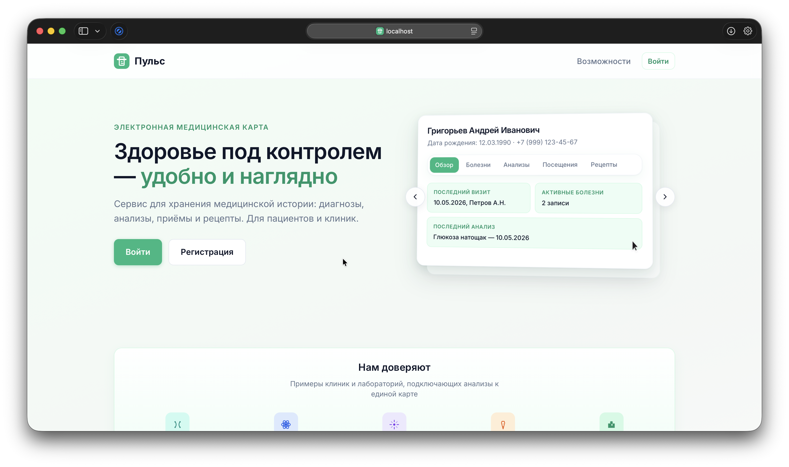
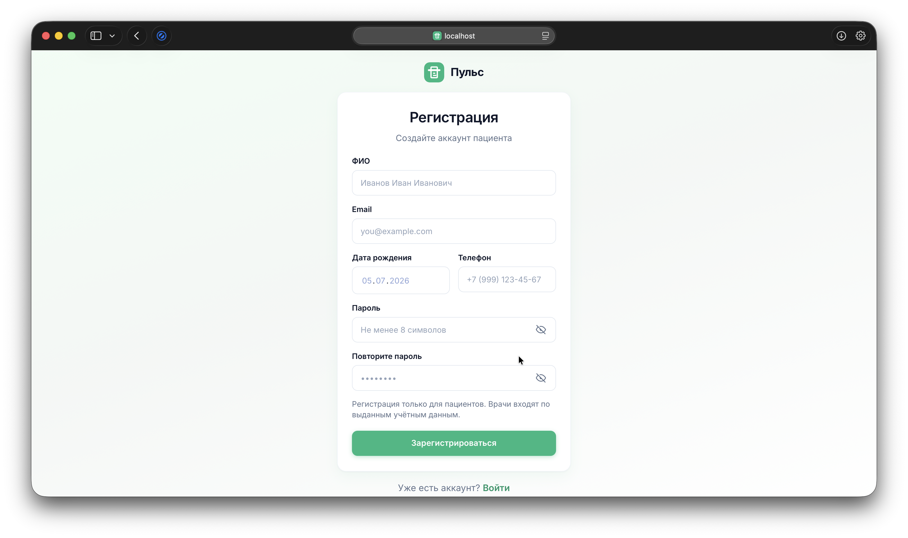
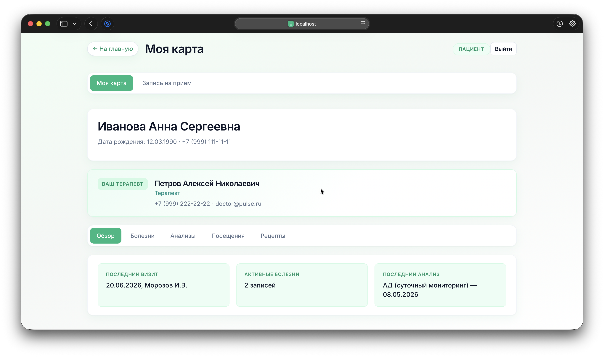
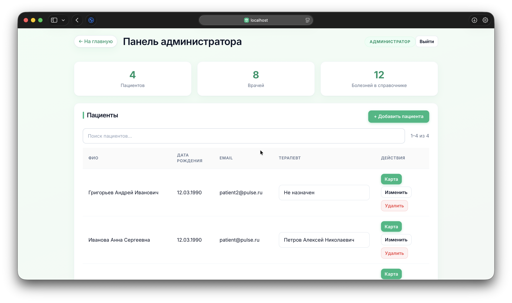
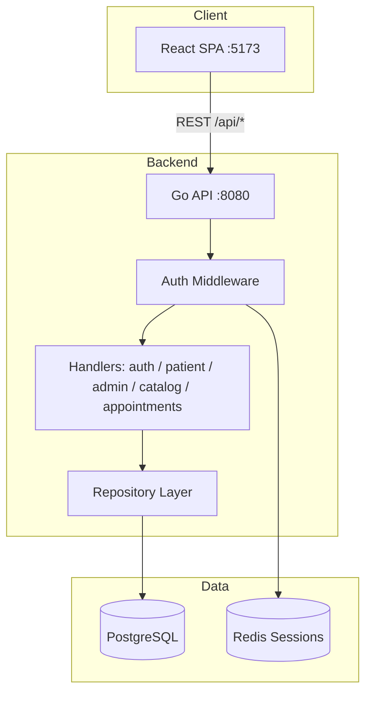

# Pulse — Electronic Medical Record Platform

**Pulse** (*Пульс*) is a full-stack web application for managing electronic medical records in a clinic setting. It supports three distinct user roles — **patient**, **doctor**, and **administrator** — with role-based access control, a structured medical card (diagnoses, lab results, visits, prescriptions), ICD disease catalog integration, and an appointment booking workflow.

Built as a portfolio project demonstrating production-oriented patterns: layered Go backend, PostgreSQL schema design, Redis-backed sessions, REST API with pagination, and a React SPA with typed API clients.

<div align="center">
  <table>
    <tr>
      <td></td>
      <td></td>
    </tr>
    <tr>
      <td></td>
      <td></td>
    </tr>
  </table>
</div>

---

## Table of Contents

- [Overview](#overview)
- [Key Features](#key-features)
- [Tech Stack](#tech-stack)
- [Architecture](#architecture)
- [Data Model](#data-model)
- [API Overview](#api-overview)
- [Frontend](#frontend)
- [Security](#security)
- [Getting Started](#getting-started)
- [Demo Accounts](#demo-accounts)
- [Project Structure](#project-structure)
- [Development Commands](#development-commands)
- [Environment Variables](#environment-variables)
- [Testing](#testing)
- [Technical Highlights](#technical-highlights)
- [Roadmap](#roadmap)

---

## Overview

Pulse solves a practical problem: keeping a patient's medical history in one place while giving each role exactly the access they need.

| Role | What they see |
|------|----------------|
| **Patient** | Read-only medical card, assigned therapist info, book appointments with any specialist |
| **Doctor** | Assigned patients list, full CRUD on medical records, appointment request queue |
| **Admin** | User management, therapist assignment, ICD disease catalog maintenance |

The application includes a marketing landing page with an interactive preview of the medical card UI, login/registration flows, and separate cabinet views per role.

---

## Key Features

### Medical Card

- **Overview dashboard** — last visit, active diagnoses count, latest lab result
- **Diseases** — linked to ICD catalog (`disease_catalog`), duplicate diagnosis prevention
- **Analyses** — lab tests with type, result, and date
- **Visits** — visit history with conducting doctor tracking and clinical notes
- **Prescriptions** — medications with dosage, duration, and linked visit date

### Appointments

- Patients submit appointment requests to any doctor (including their assigned therapist)
- Doctors approve or reject pending requests; approved requests create a visit record
- Patients can cancel pending requests
- Unique constraint prevents duplicate pending requests to the same doctor

### Admin Panel

- Dashboard with paginated patient and doctor tables
- Create / edit / delete patients and doctors
- Assign a **therapist** to each patient (only users with specialty "Терапевт")
- Manage the shared ICD disease catalog used by doctors when adding diagnoses

### UX & Lists

- **Search + pagination** on all major lists (patients, diseases, analyses, visits, prescriptions, appointments, admin tables)
- Debounced search input — no full-page reload on every keystroke
- Consistent error message spacing via shared `FormMessages` component
- Password visibility toggle on auth forms

---

## Tech Stack

### Backend

| Technology | Purpose |
|------------|---------|
| **Go 1.26** | API server |
| **Gin** | HTTP router, middleware, JSON handlers |
| **PostgreSQL 16** | Primary data store |
| **Redis 7** | Server-side session storage |
| **pgx/v5** | PostgreSQL driver |
| **golang-migrate** | Schema migrations |
| **bcrypt** | Password hashing |
| **testcontainers** | Integration tests for database layer |

### Frontend

| Technology | Purpose |
|------------|---------|
| **React 19** | UI components |
| **TypeScript** | Type-safe API clients and props |
| **Vite 8** | Dev server and production build |
| **React Router 7** | Client-side routing |

### Infrastructure

| Technology | Purpose |
|------------|---------|
| **Docker Compose** | Postgres, Redis, API, frontend containers |
| **Makefile** | Unified dev workflow (`dev-setup`, `migrate-up`, etc.) |
| **Multi-stage Dockerfile** | Production API + frontend images |

---

## Architecture



### Request Flow

1. User logs in → API validates credentials, creates opaque session token, stores session payload in Redis
2. Frontend stores token in `localStorage` and sends `Authorization: Bearer <token>` on every request
3. `RequireAuth` middleware loads session from Redis; `RequireRole` enforces patient / doctor / admin access
4. Handlers delegate to repository layer; SQL queries use parameterized statements via pgx

### Backend Layout

```
cmd/
  api/       HTTP server entrypoint
  migrate/   Migration CLI (up / down / version / force)
internal/
  auth/      Login, register, logout, password hashing
  session/   Redis session store interface + implementation
  middleware/ Bearer token validation, role guards
  patient/   Medical card read/write handlers
  admin/     User CRUD, dashboard, catalog management
  catalog/   ICD disease list for doctors
  appointment/ Booking workflow handlers
  repository/ SQL queries (users, patient_card, appointments, catalog)
  pagination/ Shared q / page / limit parsing and response meta
  database/  Connection pool, health check
  server/    Gin setup, CORS, route registration
migrations/
  000001_schema   Full PostgreSQL schema
  000002_seed     Demo users, catalog, sample medical records
```

---

## Data Model

Core entities and relationships:

```
users
  ├── role: patient | doctor | admin
  ├── specialty (doctors)
  └── assigned_doctor_id → users (patients → their therapist)

disease_catalog          ICD reference (name + code)
patient_diseases         → users, → disease_catalog (unique per patient+catalog)
patient_analyses         → users
patient_visits           → users, conducting_doctor_id → users
patient_prescriptions    → users
appointment_requests     → patient, → doctor, status, optional visit_id
```

**Business rules encoded in the schema and application layer:**

- Patients can only be assigned a doctor whose specialty is **Терапевт** (therapist)
- Doctors see patients where they are the assigned therapist **or** have conducted at least one visit
- Visit edits are restricted to the conducting doctor (or assigned therapist for legacy visits without `conducting_doctor_id`)
- Duplicate ICD diagnoses per patient return HTTP `409 Conflict`
- One pending appointment request per patient–doctor pair

---

## API Overview

Base URL (local): `http://localhost:8080`  
Frontend proxy: `/api/*` → backend

### Authentication

| Method | Endpoint | Description |
|--------|----------|-------------|
| `POST` | `/auth/register` | Register new patient account |
| `POST` | `/auth/login` | Login, returns session token |
| `POST` | `/auth/logout` | Invalidate session |
| `GET` | `/auth/me` | Current user profile |

### Patients & Medical Card

| Method | Endpoint | Access |
|--------|----------|--------|
| `GET` | `/patients/me` | Patient — own card |
| `GET` | `/patients` | Doctor — assigned patients (search + pagination) |
| `GET` | `/patients/:id` | Doctor / patient (own) — full card |
| `POST/PATCH/DELETE` | `/patients/:id/diseases/*` | Doctor — CRUD diagnoses |
| `POST/PATCH/DELETE` | `/patients/:id/analyses/*` | Doctor — CRUD lab results |
| `POST/PATCH/DELETE` | `/patients/:id/visits/*` | Doctor — CRUD visits |
| `POST/PATCH/DELETE` | `/patients/:id/prescriptions/*` | Doctor — CRUD prescriptions |

### Appointments

| Method | Endpoint | Access |
|--------|----------|--------|
| `GET` | `/appointments` | Patient / doctor — list with filters |
| `POST` | `/appointments` | Patient — create request |
| `POST` | `/appointments/:id/approve` | Doctor — approve → creates visit |
| `POST` | `/appointments/:id/reject` | Doctor — reject |
| `POST` | `/appointments/:id/cancel` | Patient — cancel pending |

### Admin & Catalog

| Method | Endpoint | Access |
|--------|----------|--------|
| `GET` | `/admin/dashboard` | Admin — stats + paginated tables |
| `POST/PATCH/DELETE` | `/admin/patients/*` | Admin — patient CRUD |
| `POST/PATCH/DELETE` | `/admin/doctors/*` | Admin — doctor CRUD |
| `PATCH` | `/admin/patients/:id/assignment` | Admin — assign therapist |
| `POST` | `/admin/catalog/diseases` | Admin — add ICD entry |
| `GET` | `/catalog/diseases` | Doctor / admin — search catalog |

### List Query Parameters

All paginated endpoints support:

| Param | Default | Description |
|-------|---------|-------------|
| `q` | — | Case-insensitive text search |
| `page` | `1` | Page number |
| `limit` | `10` | Items per page (max `100`) |

Response includes:

```json
{
  "pagination": { "page": 1, "limit": 10, "total": 42, "totalPages": 5 }
}
```

Date fields use `DD.MM.YYYY` format in JSON responses.

---

## Frontend

### Pages

| Route | Page | Description |
|-------|------|-------------|
| `/` | Home | Landing page, hero card carousel preview |
| `/login` | Login | Email + password |
| `/register` | Register | Patient self-registration |
| `/patient` | Patient cabinet | Medical card + appointment booking |
| `/doctor` | Doctor cabinet | Patient list + card editing + appointment queue |
| `/admin` | Admin panel | Dashboard, user CRUD, catalog |

### Key Components

- **`PatientCardView`** — tabbed medical card (overview, diseases, analyses, visits, prescriptions); read-only for patients, editable for doctors
- **`DoctorProfileCard`** — doctor identity block in the cabinet header
- **`ListControls`** — debounced search + pagination controls
- **`HeroCardPreview`** — landing page 3D-tilted card with swipe/tab carousel
- **`AuthContext`** — session bootstrap, role-based redirects

### Styling

Custom CSS design system (`medical.css`) — no UI framework. Green/white clinical aesthetic, island-based layout, responsive breakpoints.

---

## Security

| Concern | Implementation |
|---------|----------------|
| Passwords | bcrypt hashing, never stored in plain text |
| Sessions | Opaque UUID tokens in Redis with configurable TTL (default 24h) |
| Authorization | Middleware role checks on every protected route |
| Doctor access | Patients filtered by assignment + visit history |
| Visit edits | Conducting-doctor ownership check |
| CORS | Restricted to `http://localhost:5173` in development |
| SQL injection | Parameterized queries throughout repository layer |

---

## Getting Started

### Prerequisites

- Go 1.26+
- Node.js 20+
- Docker & Docker Compose
- Make

### Quick Start (recommended)

```bash
git clone <repo-url>
cd medical-card
cp .env.example .env
make dev-setup      # Start Postgres + Redis, run migrations
make dev-api        # Terminal 1 → http://localhost:8080
make dev-frontend   # Terminal 2 → http://localhost:5173
```

Open **http://localhost:5173** and log in with a demo account (see below).

### Full Docker Stack

Runs API, frontend, Postgres, and Redis in containers:

```bash
cp .env.example .env
make docker-up      # http://localhost:5173 + http://localhost:8080
make docker-down    # Stop all services
```

### Reset Database

After migration history changes or corrupted state:

```bash
docker compose down -v
make dev-setup
```

---

## Demo Accounts

All demo passwords are listed in `migrations/000002_seed.up.sql`.

| Email | Role | Password | Notes |
|-------|------|----------|-------|
| `patient@pulse.ru` | Patient | `patient123` | Assigned to therapist Петров |
| `patient2@pulse.ru` | Patient | `patient123` | Rich demo card (Grigoriev) |
| `patient3@pulse.ru` | Patient | `patient123` | Assigned to therapist Волкова |
| `patient4@pulse.ru` | Patient | `patient123` | Cardiologist visit history |
| `doctor@pulse.ru` | Doctor | `doctor123` | Therapist — Петров А.Н. |
| `doctor2@pulse.ru` | Doctor | `doctor123` | Cardiologist — Сидоров П.И. |
| `therapist2@pulse.ru` | Doctor | `doctor123` | Therapist — Волкова М.С. |
| `admin@pulse.ru` | Admin | `admin123` | Full admin access |

Additional specialists (neurologist, dermatologist, endocrinologist, surgeon, pediatrician) are seeded for appointment booking demos.

---

## Project Structure

```
medical-card/
├── cmd/
│   ├── api/main.go              # HTTP server
│   └── migrate/main.go          # Migration runner
├── internal/                    # Application code (see Architecture)
├── migrations/
│   ├── 000001_schema.up.sql     # Tables, indexes, constraints
│   └── 000002_seed.up.sql       # Demo data
├── frontend/
│   ├── src/
│   │   ├── api/                 # Typed fetch wrappers (auth, patient, admin, catalog)
│   │   ├── components/          # Shared UI (PatientCardView, ListControls, …)
│   │   ├── context/             # AuthContext
│   │   ├── hooks/               # useDebouncedValue, useClientList
│   │   ├── pages/               # Route pages
│   │   └── styles/medical.css   # Design system
│   └── vite.config.ts           # Dev proxy /api → :8080
├── docker-compose.yml
├── Dockerfile                   # Multi-stage: prod API + frontend
├── Makefile
└── .env.example
```

---

## Development Commands

| Command | Description |
|---------|-------------|
| `make help` | Show all available targets |
| `make dev-setup` | Postgres + Redis + migrations |
| `make dev-db` | Start Postgres and Redis only |
| `make dev-api` | Run Go API on `:8080` |
| `make dev-frontend` | Run Vite dev server on `:5173` |
| `make dev-down` | Stop API, Vite, Postgres, Redis |
| `make migrate-up` | Apply pending migrations |
| `make migrate-down STEPS=1` | Roll back one migration |
| `make migrate-create NAME=foo` | Create new migration pair |
| `make build` | Compile `bin/api` |
| `make test` | Run all Go tests |
| `make watch` | Hot reload API with Air |
| `make docker-up` | Full stack in Docker |

---

## Environment Variables

Copy `.env.example` to `.env`:

| Variable | Default | Description |
|----------|---------|-------------|
| `PORT` | `8080` | API listen port |
| `DB_HOST` | `postgres` | PostgreSQL host (`localhost` when using `make dev-api`) |
| `DB_PORT` | `5432` | PostgreSQL port |
| `DB_NAME` | `medical_card` | Database name |
| `DB_USER` | `medical` | Database user |
| `DB_PASSWORD` | `password1234` | Database password |
| `DB_SCHEMA` | `public` | PostgreSQL schema |
| `REDIS_HOST` | `redis` | Redis host (`localhost` for local dev) |
| `REDIS_PORT` | `6379` | Redis port |
| `REDIS_PASSWORD` | *(empty)* | Redis password |
| `SESSION_TTL` | `24h` | Session lifetime in Redis |

> **Note:** `make dev-api` and `make migrate-up` always connect to `localhost` for DB/Redis, regardless of Docker service names in `.env`.

---

## Testing

```bash
make test           # All unit tests
make itest          # Database integration tests (testcontainers)
make build && make test   # CI-style check
```

Frontend:

```bash
cd frontend && npm run build   # TypeScript check + production build
cd frontend && npm run lint    # ESLint
```

---

## Technical Highlights

Portfolio-relevant design decisions:

1. **Server-side sessions in Redis** — instant logout, no JWT secret rotation concerns, session data stays on the server
2. **Repository pattern** — handlers stay thin; SQL isolated in `internal/repository`
3. **Shared pagination package** — consistent `q`, `page`, `limit` across all list endpoints
4. **Squashed migrations** — clean `schema + seed` split for easy fresh installs
5. **Conducting doctor model** — visits track who actually saw the patient, enabling fine-grained edit permissions
6. **ICD catalog FK** — diagnoses reference a shared catalog; duplicate prevention at DB + API + UI level
7. **Appointment → visit pipeline** — approved booking automatically creates a visit record linked by `visit_id`
8. **Typed frontend API layer** — no raw fetch scattered in components; centralized error handling via `ApiError`
9. **Debounced list search** — soft loading pattern keeps table visible during refetch

---

## Roadmap

Planned improvements (not yet implemented):

- [ ] File uploads for lab results (S3 / object storage)
- [ ] Email notifications for appointment status changes
- [ ] Audit log for medical record edits
- [ ] OpenAPI / Swagger spec generation
- [ ] E2E tests (Playwright)
- [ ] Production deployment guide (TLS, secrets management)

---

## License

This project was built for educational and portfolio purposes.
